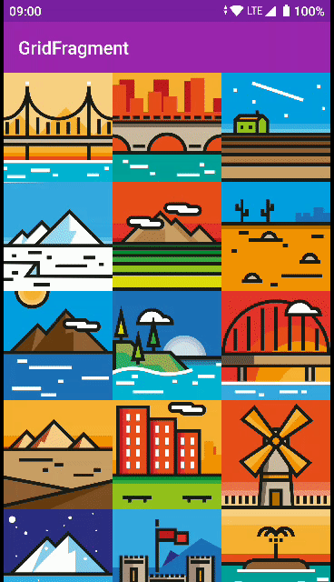

# android-recyclerview-playground

## Shared element

### Between Activities

`[`
  [`Grid`](activitysharedelements/src/main/java/com/spundev/activitysharedelements/GridActivity.kt)
`|`
  [`Detail`](activitysharedelements/src/main/java/com/spundev/activitysharedelements/DetailActivity.kt)
`]`

Simple example of how to share an element between two activities + RecyclerView.

The GridActivity RecyclerView is able to scroll to position if the element is hidden.

:memo: **TO-DO**: Add a ViewPager to the detail activity to show this behavior in a better way.

### Between Fragments (Navigation component)

`[`
  [`Grid`](navigationsharedelements/src/main/java/com/spundev/navigationsharedelements/GridFragment.kt)
`|`
  [`Detail`](navigationsharedelements/src/main/java/com/spundev/navigationsharedelements/DetailFragment.kt)
`]`

Same example as before but using the [navigation component](https://developer.android.com/guide/navigation) from jetpack to show the details fragment.

:memo: **TO-DO**: Because shared elements in Fragment Transitions are not drawn in the overlay by default [[link]](https://stackoverflow.com/a/27906055), and also because each item of the RecyclerView has a different elevation, we might have problems when the item is returning to the grid.

In this example, we see how the item is partially occluded by other items that have a higher elevation. [[Possible solutions]](https://youtu.be/912hbLVdIQE?t=1772)

---

## Item selection

`[`
  [`Grid`](multiselect/src/main/java/com/spundev/multiselect/GridActivity.kt)
`]`

References:

- [How to Add Multiple Selection to Android RecyclerView](https://code.tutsplus.com/tutorials/how-to-add-selection-support-to-a-recyclerview--cms-32175) from Envato Tuts+
- [Android Developers Docs](https://developer.android.com/reference/androidx/recyclerview/selection/package-summary)

---

## Fixed header decoration

`[`
  [`ItemDecoration`](fixedheader/src/main/java/com/spundev/fixedheader/DateHeaderDecoration.kt)
`]`

References:

- [ScheduleTimeHeadersDecoration](https://github.com/google/iosched/blob/master/mobile/src/main/java/com/google/samples/apps/iosched/ui/schedule/ScheduleTimeHeadersDecoration.kt) from [2019 Google I/O Android App](https://github.com/google/iosched)

---

Images made by [Freepik](https://www.flaticon.com/authors/freepik "Freepik") from [www.flaticon.com](https://www.flaticon.com/packs/landscapes-color "Flaticon")